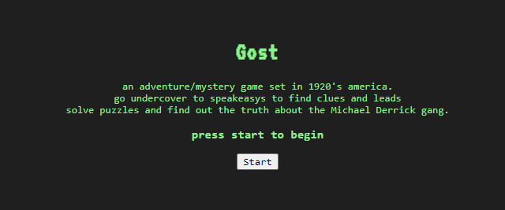

# TextBased-Adventure

[Github](https://github.com/evan-ebert17/PersonalPortfolioREDUX/)  
[Deployed React App](https://eeportfolio.herokuapp.com/)

## Screen Shots

##### Table of Contents  
[Purpose](#purpose)  
[Features](#features)  
[Premise](#premise)
[Technologies Used](#technologies-used)  
[Installation](#installation)  
[Usage](#usage)  
[Credits](#credits)  
[License](#license)  

## Purpose  
This is a side project I was making during boot-camp. It was a way to creatively express myself while in bootcamp outside of the coursework we were doing. Now that I have graduated the course, I have updated the game with more content and intend to finish it eventually, but the first segment of the game is playable!

## Features 
Classic Text Based Adventure Game mechanics, such as "examine", look, go left etc. and a story about a 1920's mystery.

## Premise  
You are a police detective in 1920's America trying to uncover a secret underground drug ring, but you dont know how deep this hole goes...

## Technologies-Used  
Currently made with JavaScript and HTML5/CSS.

## Installation  
There is no need to install this application for use, because it is hosted at the links provided above. However, for code inspection or etc, if you have SSH Keys linked, you can simple use your terminal and clone the repo down, otherwise, the typical zip.

## Usage  
Inside the game, there are a multitude of functions, such as the saving mechanic, which saves your game into localstorage or loads it based on the former. There are traditional tba commands such as go left, go right, inspect, examine, but there are also new inclusions such as the inventory and map w/ character icon to indicate your location. type "HELP" for more commands or general inquiries about further functions of the game.

## Credits
This project was made by  
[Evan Ebert](https://github.com/evan-ebert17)

## License

Copyright 2021 Evan Ebert

Permission is hereby granted, free of charge, to any person obtaining a copy of this software and associated documentation files (the "Software"), to deal in the Software without restriction, including without limitation the rights to use, copy, modify, merge, publish, distribute, sublicense, and/or sell copies of the Software, and to permit persons to whom the Software is furnished to do so, subject to the following conditions:

The above copyright notice and this permission notice shall be included in all copies or substantial portions of the Software.

THE SOFTWARE IS PROVIDED "AS IS", WITHOUT WARRANTY OF ANY KIND, EXPRESS OR IMPLIED, INCLUDING BUT NOT LIMITED TO THE WARRANTIES OF MERCHANTABILITY, FITNESS FOR A PARTICULAR PURPOSE AND NONINFRINGEMENT. IN NO EVENT SHALL THE AUTHORS OR COPYRIGHT HOLDERS BE LIABLE FOR ANY CLAIM, DAMAGES OR OTHER LIABILITY, WHETHER IN AN ACTION OF CONTRACT, TORT OR OTHERWISE, ARISING FROM, OUT OF OR IN CONNECTION WITH THE SOFTWARE OR THE USE OR OTHER DEALINGS IN THE SOFTWARE.
